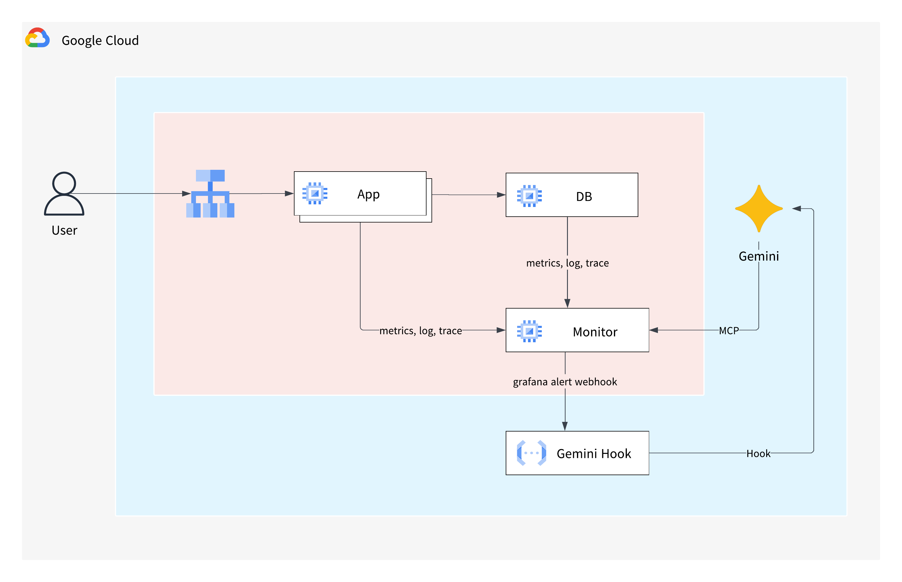
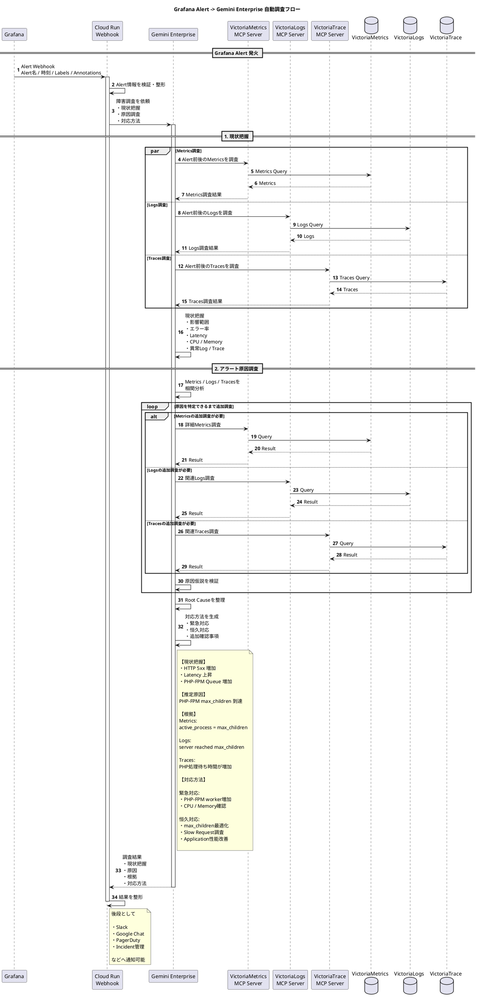

# 記事タイトル

## はじめに
こんにちは、新井です。
インフラを運用していてこんなことを思ったことはないでしょうか？
・アラート原因を調査するために複数のメトリクスを横断的に確認するのが面倒

そこで今回は、VictoriaMtrics/VictoriaLogs/VictoriaTracesとMCP Serverを組み合わせ、Grafana Alertを起点にGemini Enterpriseに調査をさせる仕組みを試してみます。

構成としては、Grafanaでアラートを検知するとCloudRun経由でGemini Enterpriseを呼び出し、Gemini Enterpriseから各MCP Serverを利用してVictoriaMetrics, VictoriaLogs, VictoriaTracesの情報を取得できるようにします。

## 構成

各種サーバ
- Application Server
  - NGINX
  - PHP-FPM
  - NGINX Exporter
  - PHP-FPM Exporter
  - OpenTelemetry Collector
- Database Server
  - MySQL
  - MySQL Exporter
  - OpenTelemetry Collector
- Monitor Server
  - VictoriaMetrics
  - VictoriaLogs
  - VictoriaTrace
  - VictoriaMetrics MCP Server
  - VictoriaLogs MCP Server
  - VictoriaTrace MCP Server
  - Grafana
- Gemini Hook (Cloud Run)
  - Golang

基本的にはApplicationとDatabaseからメトリクス、ログ、トレースをVictoriaMetrics/Logs/Tracesへ集約し、grafanaから描画します。
そこへMCP Serverを追加しgemini enterpriseからアクセスできるようにします。
またgrafana alertが発報された際に、

## 処理フロー

## 試したユースケース

## まとめ